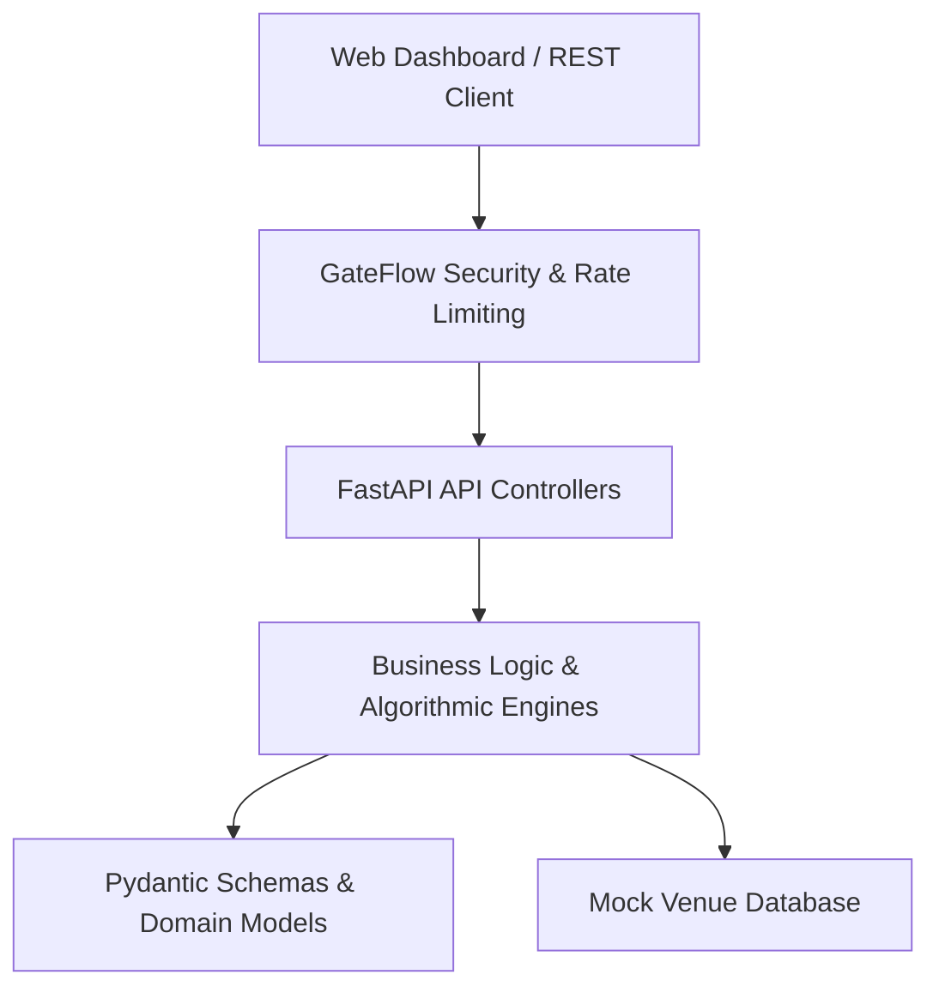

# GateFlow API

🚀 **Live Deployment:** [https://gateflow.duckdns.org/](https://gateflow.duckdns.org/)

GateFlow is a real-time stadium pedestrian flow routing and transit advising system. It calculates optimized paths for stadium arrivals and egress, taking into account user context, seat sections, real-time gate congestion levels, and accessibility needs. The system features a deterministic core routing engine paired with a localized templates or LLM phrasing layer (using Google Gemini) to generate natural language directions.

## Key Features

- **Optimal Gate Selection**: Finds the best entry gate based on seating section, kickoff countdown urgency, accessibility, and real-time congestion.
- **Post-Match Egress Routing**: Recommends the safest and fastest exit routes from seating sections to onward transit terminals (metro, parking, rideshare).
- **Dijkstra-Based Concourse routing**: Computes step-free paths using concourse distance weightings.
- **Dynamic Congestion Simulation**: Deterministic, seed-stable simulation of gate traffic based on kickoff timing and historical traffic curves.
- **Phrasing Layer (Dual mode)**: Combines reliable offline multi-language templates with a Google Gemini LLM reframing layer for conversational answers.
- **Transit Advisor**: Ranks transit options based on travel times, waiting delays, and terminal congestion.
- **Enterprise-Grade Security**: Active prompt-injection filtering, client IP rate-limiting with local fallback, and robust security headers.

---

## Technical Architecture

The codebase follows strict architectural layering guidelines:


### Layer Boundary Constraints
1. **API Controllers** (`app/api/`): Define path parameters, schemas, and coordinate service handlers.
2. **Domain Models** (`app/models/`): Houses standard type models and schemas without network or disk IO.
3. **Logic Services** (`app/services/`): Pure algorithmic logic and graph traversals.
4. **Third-Party dependencies**: Isolated in thin client wrappers (e.g. `GeminiClient` in `app/services/llm_client.py`).

---

## API Documentation

### 1. Interactive Copilot Guidance
* **Endpoint**: `POST /api/assist`
* **Request Schema (`FanContextSchema`)**:
  ```json
  {
    "language": "en",
    "arrival_mode": "metro",
    "current_location": "metro_station",
    "ticket_section": "128",
    "accessibility_needs": ["mobility"],
    "minutes_to_kickoff": 45,
    "question": "I am arriving by metro with a wheelchair, help me get to section 128."
  }
  ```
* **Response Schema (`AssistResponseSchema`)**:
  ```json
  {
    "answer": "Hello! Please head to Gate C...",
    "decision": {
      "recommended_gate": "gate_c",
      "urgency_tier": "normal",
      "congestion": {
        "gate_a": "medium",
        "gate_b": "low",
        "gate_c": "low"
      },
      "route_steps": ["metro_station", "gate_c", "section_128"],
      "accessibility_mode": ["step_free"],
      "used_llm": true
    }
  }
  ```

### 2. Onward Transportation Advice
* **Endpoint**: `GET /api/transport/advice`
* **Query Parameters**:
  - `minutes_to_kickoff`: Integer minutes to kickoff.
  - `accessibility_needs`: Optional list of tags (e.g., `mobility`).
* **Response Schema (`TransportAdviceResponseSchema`)**:
  ```json
  {
    "options": [
      {
        "mode": "metro",
        "name": "Metro Terminal",
        "eta_minutes": 10.0,
        "wait_minutes": 5.0,
        "congestion": "low",
        "arrival_node": "metro_station",
        "total_travel_time_minutes": 15.0
      }
    ]
  }
  ```

### 3. Venue Layout Metadata
* **Endpoint**: `GET /api/venue`
* **Response Schema (`VenueInfoResponseSchema`)**: returns stadium metadata, zones list, and section mappings.

### 4. Gate Live Conditions
* **Endpoint**: `GET /api/venue/gates`
* **Query Parameters**:
  - `minutes_to_kickoff`: Integer minutes to kickoff.
* **Response Schema (`list[GateDetailSchema]`)**: returns real-time simulated capacity, occupancy, and congestion.

---

## Local Setup

### Prerequisites
- Python 3.11 or later
- Virtual environment tool

### Installation
1. Clone the repository and navigate to the project directory:
   ```bash
   cd GateFlow
   ```
2. Create and activate a virtual environment:
   ```bash
   python -m venv .venv
   # Windows:
   .venv\Scripts\activate
   # macOS/Linux:
   source .venv/bin/activate
   ```
3. Install production and development dependencies:
   ```bash
   pip install -r requirements.txt
   pip install -r requirements-dev.txt
   ```
4. Copy the environment template and configure settings:
   ```bash
   cp .env.example .env
   ```

### Running Locally
To launch the FastAPI development server:
```bash
python -m uvicorn app.main:app --reload --port 8000
```
Visit `http://localhost:8000` to interact with the static SPA dashboard dashboard.
Access OpenAPI documentation at `http://localhost:8000/docs`.

---

## Development Checks

Strict coding standards are enforced via automated quality checks:

### 1. Code Quality & Linting (Ruff)
Run Ruff checks:
```bash
ruff check app tests
```

### 2. Static Typing Verification (Mypy)
Run strict type checking:
```bash
mypy app
```

### 3. Docstring Coverage (Interrogate)
Verify that all public classes, methods, and modules have docstrings:
```bash
interrogate app
```

### 4. Code Complexity (Radon)
Ensure that all blocks have a cyclomatic complexity strictly less than 10 (Rank A/B):
```bash
radon cc app -s
```

### 5. Running Tests & Code Coverage (Pytest)
Run the test suite with strict coverage enforcement:
```bash
pytest --cov=app --cov-branch --cov-fail-under=100
```

---

## Cloud Deployment Guides

GateFlow is fully containerized and cloud-ready. Refer to the step-by-step guides below to deploy to your preferred cloud provider:

- **[Deploy to Google Cloud Run](DEPLOYMENT.md)** - Serverless container deployment
- **[Deploy to Microsoft Azure VM](AZURE_VM_DEPLOYMENT.md)** - Dedicated Virtual Machine deployment

## Local Deployment (Docker)

To build and run the slim production container locally:
```bash
# Build the Docker image
docker build -t gateflow:latest .

# Run the container
docker run -p 8000:8000 gateflow:latest
```
The server will be reachable at `http://localhost:8000`.

---

## License

This project is licensed under the terms of the [MIT License](LICENSE).
